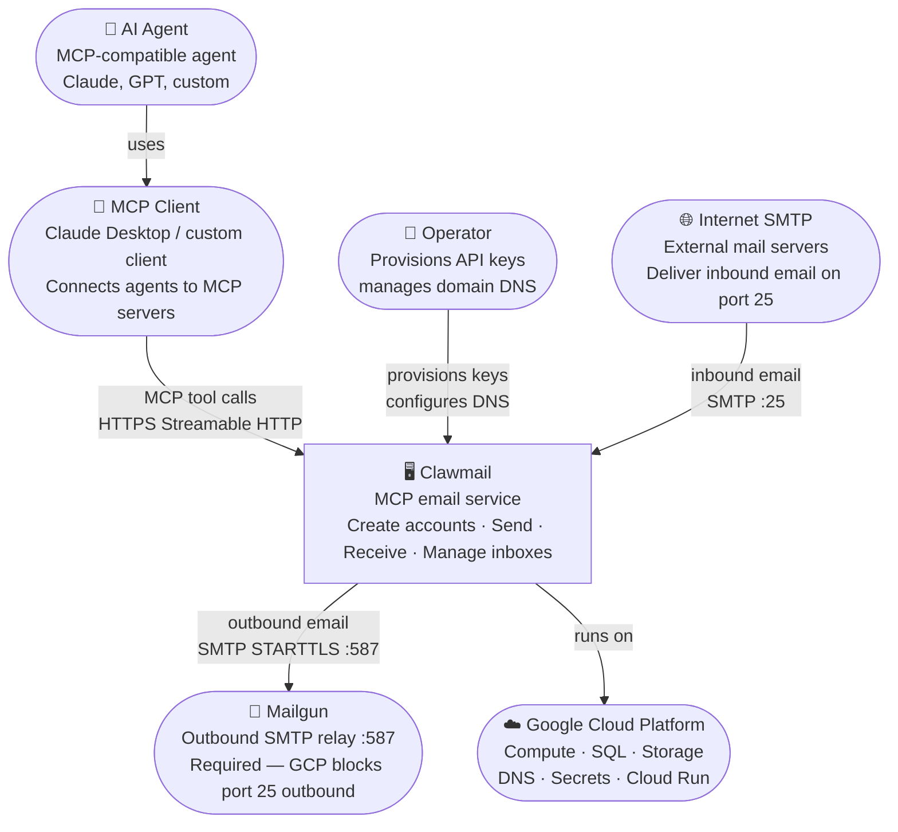
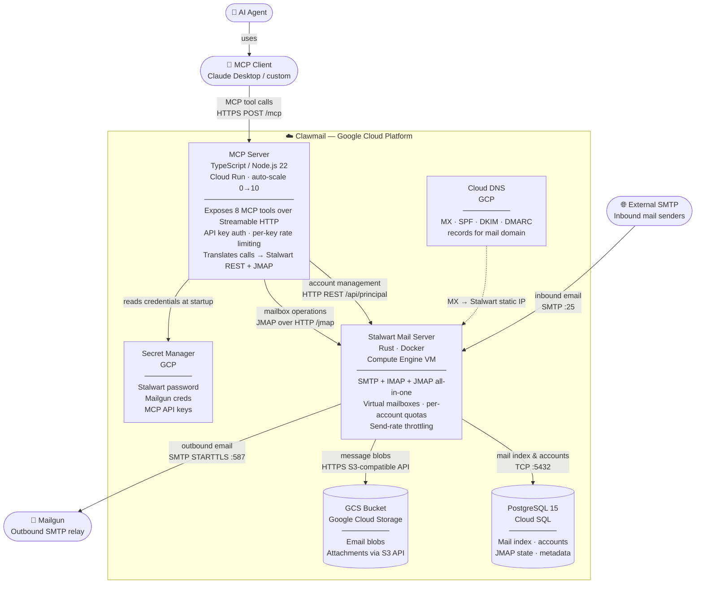
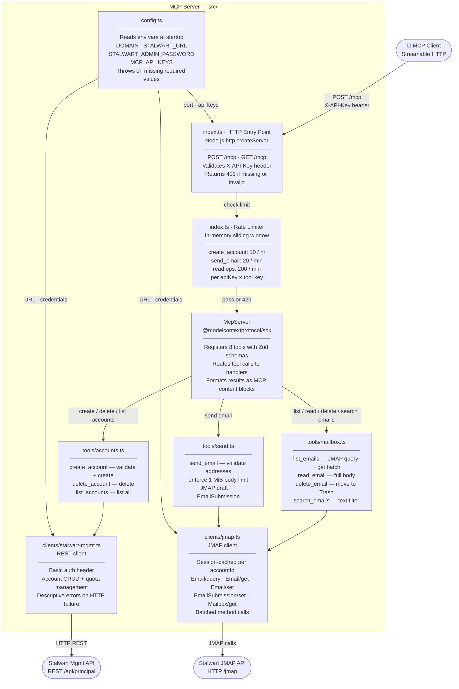
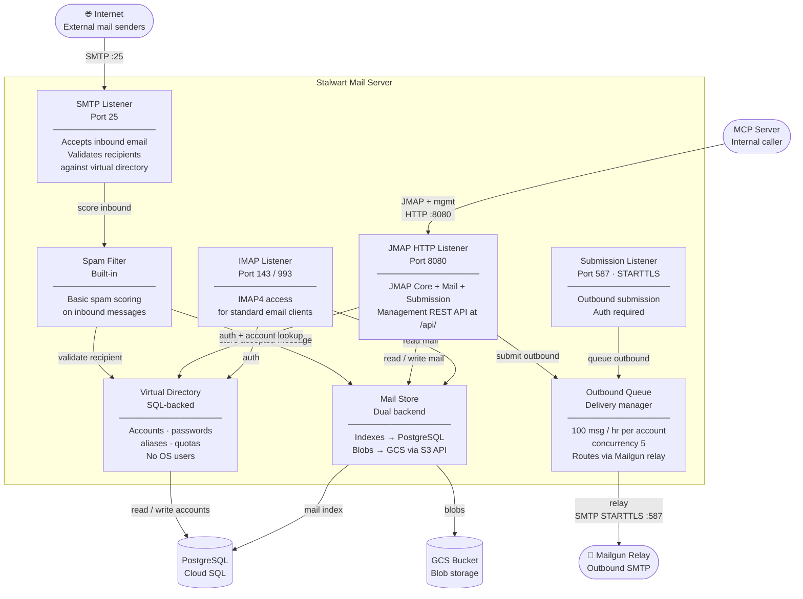
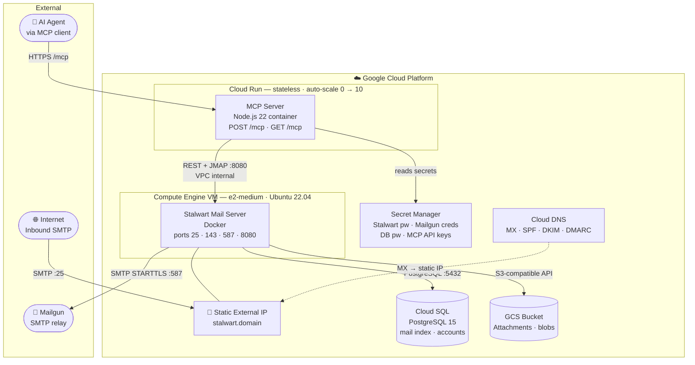

# Clawmail — C4 Architecture Diagrams

C4 model diagrams rendered in [Mermaid](https://mermaid.js.org/) using `flowchart` syntax. Three levels: Context → Container → Component.

---

## Level 1 — System Context

Who uses Clawmail and what external systems does it depend on?

---

## Level 2 — Container Diagram

What are the deployable units and how do they communicate?

---

## Level 3 — Component Diagram: MCP Server

What are the internal components of the MCP Server?

---

## Level 3 — Component Diagram: Stalwart Mail Server

What are the internal subsystems of Stalwart?

---

## Deployment View

Where does each container run in GCP?

